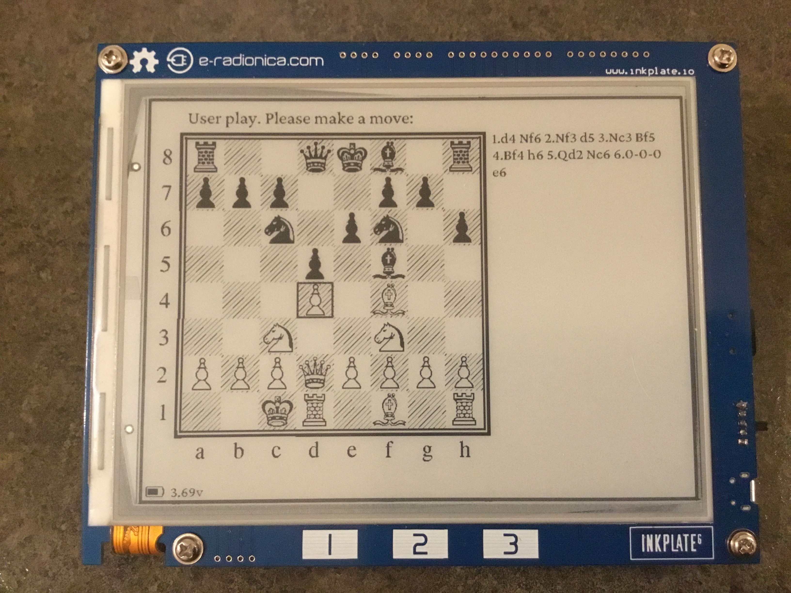

# Chess-InkPlate A Simple Chess Player for the InkPlate devices

## Last news

(Updated 2021.01.26)

This is a simple chess application for the InkPlate devices. It is based on the chess engine developped by Sergey Urusov as an Arduino project. I edited and ported the engine for inclusion under the ESP-IDF framework. You can find Sergey's original code [here](https://www.hackster.io/Sergey_Urusov).



I've used the framework developped for the EPub-InkPlate app. It was extracted from the specifics of the EPub reader and adapted for the Chess-InkPlate app. These are the steps taken to build it:

- [x] Extraction of the Chess Engine portion required from the Arduino code
- [x] Transformation of the Engine in C++
- [x] Engine integration in my own InkPlate framework
- [x] Integration of Chess fonts
- [x] Graphical Chess board display
- [x] Interaction with the chess board
- [x] Integration with the chess engine
- [x] PGN notation
- [x] Menu for main actions
- [x] Menu for chess font selection
- [x] Menu for pawn promotion 
- [x] Pawn promotion integration
- [x] Current game save and load on deep sleep
- [x] User Manual
- [x] Installation manual
- [x] Deep Sleep management
  
Potential features for v2.0:

- [ ] Access to external chess engines
- [ ] Book moves for beginning of games
- [ ] Games database display and interaction
- [ ] Training (puzzle)
- [ ] Play against other users through internet chess servers
- [ ] Played games save/load/replay

### Runtime environment

The Chess-InkPlate application requires that a micro-SD Card be present in the device. This micro-SD Card must be pre-formatted with a FAT32 partition. One folder must be present in the partition: `fonts`. You must put the base fonts in the `fonts` folder. 

The `SDCard` folder under GitHub reflects what the micro-SD Card should look like. 

### Fonts cleanup

All (non-chess) fonts have been subsetted to Latin-1 plus some usual characters. The `fonts/orig` folder in the GitHub project contains all original fonts that are processed using the script `fonts/subsetter.sh`. This script uses the Python **pyftsubset** tool that is part of the **fontTools** package. To install the tool, you need to execute the following command:

```bash
$ pip install fonttools brotli zopfli
```

The script takes all font from the `orig` folder and generate the new subset fonts in `subset-latin1/otf` folder. The following commands must be executed:

```bash
$ cd fonts
$ ./subsetter.sh
```

After that, all fonts in the `subset-latin1/otf` and `chess` folder must be copied back in the `SDCard/fonts` folder.

## Development environment

[Visual Studio Code](https://code.visualstudio.com/) is the code editor I'm using. The [PlatformIO](https://platformio.org/) extension is used to manage application configuration for both Linux and the ESP32.

All source code is located in various folders:

- Source code used by both Linux and InkPlate is located in the `include` and `src` folders
- Source code in support of Linux only is located in the `lib_linux` folder
- Source code in support of the InkPlate device (ESP32) only are located in the `lib_esp32` folder
- The FreeType library for ESP32 is in folder `lib_freetype`

The file `platformio.ini` contains the configuration options required to compile both Linux and InkPlate applications.

Note that source code located in folders `old` and `test` is not used. It will be deleted from the project when the application development will be completed.

### Dependencies

The following are the libraries currently in use by the application:

- [GTK+3](https://www.gtk.org/) (Only for the Linux version) The development headers must be installed. This can be done with the following command (on Linux Mint):
  
  ``` bash
  $ sudo apt-get install build-essential libgtk-3-dev
  ```

The following is imported C header and source files, that implement some algorithms:

- [FreeType](https://www.freetype.org) (Parse, decode, and rasterize characters from TrueType fonts) A version of the library has been loaded in folder `freetype-2.10.4/` and compiled with specific options for the ESP32. See sub-section **FreeType library compilation for ESP32** below for further explanations.

### FreeType library compilation for ESP32

The FreeType library is using a complex makefile structure to simplify (!) the compilation process. Here are the steps used to get a library suitable for integration in the Chess-InkPlate ESP32 application. As this process is already done, there is no need to run it again, unless a new version of the library is required or some changes to the modules selection are done.

1. The folder named `lib_freetype` is created to receive the library and its dependencies at install time:

    ``` bash
    $ mkdir lib_freetype
    ```

2. The ESP-IDF SDK must be installed in the main user folder. Usually, it is in folder ~/esp. The following location documents the installation procedure: https://docs.espressif.com/projects/esp-idf/en/latest/esp32/get-started/index.html . Look at Steps 1 to 4 (Setting Up Development Environment). This is important as the configuration setup below will access ESP32 related compilation tools.

3. The files `freetype-2.10.4/modules.cfg` and `freetype-2.10.4/include/freetype/config/ftoption.h` are modified to only keep the capabilities required to support TrueType and OpenType fonts. The original files have been saved in `*.orig` files.

4. A file named `freetype-2.10.4/myconf.sh` is created to simplify the configuration of the makefile structure. The `--prefix` option may require some modification to take into account the location where the Chess-InkPlate source code has been put. The `--prefix` must point to the `lib_freetype` folder.

5. The following commands are executed:

   ``` bash
   $ cd freetype-2.10.4
   $ bash myconf.sh
   $ make
   $ make install
   ```

   This will have created several files in the folder `lib_freetype`.

6. Edit file named `lib_freetype/lib/pkgconfig/freetype2.pc` and remove the entire line that contains `harfbuzz` reference.
7. Voilà...

### ESP-IDF configuration specifics

The Chess-InkPlate application requires some functionalities to be properly set up within the ESP-IDF. To do so, some parameters located in the `sdkconfig` file must be set accordingly. This must be done using the menuconfig application that is part of the ESP-IDF. 

The ESP-IDF SDK must be installed in the main user folder. Usually, it is in folder ~/esp. The following location documents the installation procedure: https://docs.espressif.com/projects/esp-idf/en/latest/esp32/get-started/index.html . Look at Steps 1 to 4 (Setting Up Development Environment).

The following command will launch the application (the current folder must be the main folder of Chess-InkPlate):

  ```
  $ idf.py menuconfig
  ```
  
The application will show a list of configuration aspects. 

The following elements have been done (No need to do it again):
  
- **PSRAM memory management**: The PSRAM is an extension to the ESP32 memory that offers 4MB+4MB of additional RAM. The first 4MB is readily available to integrate into the dynamic memory allocation of the ESP-IDF SDK. To configure PSRAM:

  - Select `Component Config` > `ESP32-Specific` > `Support for external, SPI-Connected RAM`
  - Select `SPI RAM config` > `Initialize SPI RAM during startup`
  - Select `Run memory test on SPI RAM Initialization`
  - Select `Enable workaround for bug in SPI RAM cache for Rev 1 ESP32s`
  - Select `SPI RAM access method` > `Make RAM allocatable using malloc() as well`

  Leave the other options as they are. 

- **ESP32 processor speed**: The processor must be run at 240MHz. The following line in `platformio.ini` request this speed:

    ```
    board_build.f_cpu = 240000000L
    ```
  You can also select the speed in the sdkconfig file:

  - Select `Component config` > `ESP32-Specific` > `CPU frequency` > `240 Mhz`

- **FAT Filesystem Support**: The application requires the usage of the micro SD card. This card must be formatted on a computer (Linux or Windows) with a FAT32 partition (maybe not required as this is the default format of brand new cards). The following parameters must be adjusted in `sdkconfig`:

  - Select `Component config` > `FAT Filesystem support` > `Max Long filename length` > `255`
  - Select `Number of simultaneously open files protected  by lock function` > `5`
  - Select `Prefer external RAM when allocating FATFS buffer`
  - Depending on the language to be used (My own choice is Latin-1 (CP850)), select the appropriate Code Page for filenames. Select `Component config` > `FAT Filesystem support` > `OEM Code Page...`. DO NOT use Dynamic as it will add ~480KB to the application!!
  - Also select `Component config` > `FAT Filesystem support` > `API character encoding` > `... UTF-8 ...`

- **HTTP Server**: (This is a feature to be made available in version 2.0) The application is supplying a Web server (through the use of HTTP) to the user to modify the list of games present on the SDCard. The following parameters must be adjusted:
  - Select `Component config` > `HTTP Server` > `Max HTTP Request Header Length` > 1024
  - Select `Component config` > `HTTP Server` > `Max HTTP URI Length` > 1024

The following is not configured through *menuconfig:*

- **Flash memory partitioning**: the file `partitions.csv` contains the table of partitions required to support the application in the 4MB flash memory. The factory partition has been set to be ~2.4MB in size (OTA is not possible as the application is too large to accomodate this feature; the OTA related partitions have been commented out...). In the `platformio.ini` file, the line `board_build.partitions=...` is directing the use of these partitions configuration.
